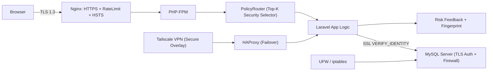
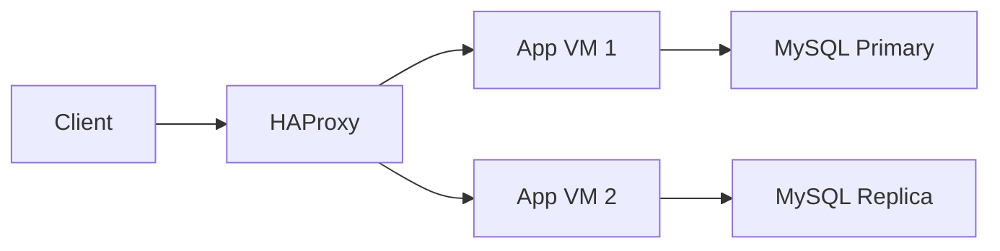

# 🍱 Ajojing Food Order — Secure Distributed System (UTS Project)

<p align="center">
  
  
  
  
  
  
  
  
  
</p>

---

## 📖 Overview

Ajojing Food Order is a secure, distributed Laravel-based food ordering system built for the **Distributed Computing 2025**.

It runs on **Proxmox VE** for VM isolation, **Tailscale VPN** for secure remote access, **Nginx + HAProxy** for HTTPS termination and failover, and integrates a **DeepSeek-inspired Adaptive Security Model** that activates only the top-K relevant security layers per request.

---

## 🧩 Architecture



---

## ⚙️ Components

| Layer | Function |
|-------|-----------|
| **Proxmox VE** | Virtualized multi-VM environment |
| **Tailscale VPN** | Secure overlay network for remote demo |
| **Nginx** | Reverse proxy, TLS termination, rate limiting |
| **HAProxy** | App-level load balancing and failover |
| **Laravel 11** | Main web framework |
| **MySQL (SSL)** | Encrypted DB with certificate-based auth |
| **Firewall (UFW)** | Restricts DB access to App VM only |

---

## 🧠 Adaptive Security (DeepSeek-Style)

### 1️⃣ Sparse Middleware Activation (SMA)
Only the most relevant K security modules are activated dynamically.

| Route | Active Modules |
|--------|----------------|
| `/api/public/menu` | RateLimit, AuditLog |
| `/api/user/order` | AuthN, RBAC, InputGuard, RateLimit |
| `/api/admin/*` | AuthN, RBAC, InputGuard, Anomaly, AuditLog |

### 2️⃣ Risk Scoring Feedback
Learns from module performance and reweights their priority over time.

### 3️⃣ User Fingerprint
Detects behavior deviation (time, IP, device) and triggers tighter controls.

### 4️⃣ Security Dashboard
Visualizes real-time heatmaps of module activations, anomalies, and response metrics.

---

## 🛡️ Security Verification

| Layer | Protection | Verification |
|-------|-------------|--------------|
| Client → App | HTTPS (TLS 1.3) | Wireshark handshake |
| App → DB | SSL `VERIFY_IDENTITY` | mysql client check |
| App Layer | RBAC, Input Validation | 403/400 logs |
| Network | Firewall isolation | nmap / ufw status |
| VPN | Encrypted overlay | Packet inspection |

---

## 🖥️ High Availability

HAProxy automatically reroutes requests to a standby App VM when primary fails.  
MySQL uses a read-only fallback or replication for resilience.



---

## 🧪 Testing Commands

```bash
# Verify DB SSL
mysql --ssl-mode=VERIFY_IDENTITY -h 192.168.1.41 -u app_user -p

# Capture encrypted packets
sudo tcpdump -i any tcp port 3306 -w /tmp/app-db.pcap

# Firewall check
sudo ufw status

# Run adaptive feedback loop
php artisan security:feedback
```

---

## 🌐 Access

**Demo URL:** https://food.local → `100.88.202.6` (via Tailscale)  
> Import CA certificate into system trust store to remove HTTPS warnings.

---

## 📸 Proof & Demo Checklist

✅ HTTPS padlock visible in browser  
✅ TLS handshake captured via Wireshark  
✅ App→DB verified via SSL identity check  
✅ 403/429 security logs generated  
✅ HAProxy failover works live  
✅ Dashboard heatmap responsive

---

## 👨‍💻 Contributors

| Role | Name |
|------|------|
| Project Lead | You |
| System Integration | Teammate |
| DeepSeek Security Model | You |
| Documentation | Shared |

---

## 📜 License

Educational use only — **Distributed Computing 2025**

---

<h3 align="center">🌟 Inspired by DeepSeek V3.2 Sparse Attention 🌟</h3>
<p align="center"><i>“Activate only what’s needed, when it’s needed.”</i></p>
